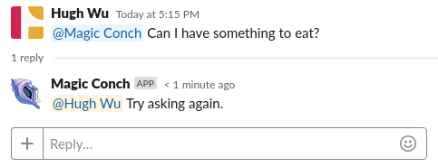
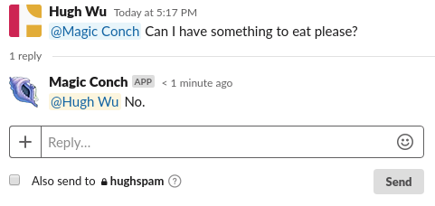

# Magic Conch Bot

The Magic Conch Bot is a Slack bot that responds to a message with a predefined answer whenever a user @'s it. The answer is guaranteed to be always correct, but I am not responsible for whatever happens as a result of consulting the Magic Conch.

This bot is a clone of the [Skeleton Slackbot found here](https://github.com/UF-ACE/Skeleton-Slackbot).